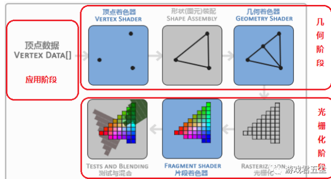

# opengl note 1 --- 绘制基础流程
大约半年前看过闫令琪先生的game101，惊讶于虚拟现实的魅力；想到毕业至今已做了1年流媒体win客户端开发，2年的应用计算几何开发，也以osAPI搭建了一个io复用的tcp服务，仍觉得管线的工作原理，渲染、特效的设计编写充满魅力，相较于各种封装调包的业务；

这是笔者的opengl学习笔记，旨在结合opengl和game101中提及的基础管线工作理论，对相关api的调用和核心功能实现有个大致了解；有错误欢迎留言踹我，blog服务暂未开发留言功能，可通过邮箱联系（zhoupinyi97@outlook.com）

如果对opengl的系列库没有了解，可以查阅笔者《opengl入门demo》的分享

## 渲染管线的详细工作步骤
总的来讲，图形管线将3维的坐标投影为2d，并渲染出像素；它的工作是线性流水线的，因此显卡有大量的核心使用管线快速计算数据;处理核心在管道的每个步骤上在GPU上运行小程序。这些小程序被称为着色器。opengl提供glsl让我们写自己的着色器<https://learnopengl.com/Getting-started/Hello-Triangle>

*输入处理阶段*：渲染管线的输入是表示图形的定点信息，它通常由3D建模软件生成。在输入处理阶段，输入数据被传递到GPU中。

*顶点处理阶段*：在这个阶段，对所有输入的顶点进行处理，并将它们从3D世界空间转换到屏幕空间。这个过程中还可以对顶点属性进行插值。这些顶点通常被转化为组成三角形的三个向量，每个顶点可以简单认为有个对应的颜色值匹配；（顶点着色器）
> MVP矩阵是在顶点处理阶段计算的，由三个矩阵乘法组成的，即模型矩阵（Model）、视图矩阵（View）和投影矩阵（Projection），即MVP = Projection * View * Model。这个矩阵被用于将顶点从模型空间转换到裁剪空间。

> 模型矩阵是用于将模型从局部坐标系转换到世界坐标系，也就是对模型的位置、旋转和缩放进行变换。
> 视图矩阵是用于将所有物体从世界坐标系转换到观察坐标系或相机坐标系，也就是对摄像机的位置、方向和姿态进行变换，使得所有的物体相对于视图矩阵的原点和方向进行展示。

> 投影矩阵是用于将物体从观察坐标系转换到裁剪空间坐标系，即显示在二维屏幕上的坐标系，通常是一个四维矩阵。

> 计算MVP矩阵需要将这三个矩阵相乘。在计算过程中，通常按照Model * View * Projection的顺序进行矩阵乘法计算，而投影矩阵的计算通常使用透视投影或正交投影。这个过程需要在GPU上进行，因此使用着色器语言编写一个包括顶点着色器和片元着色器的计算流程，对每个顶点进行MVP矩阵的计算，最终生成裁剪空间中的顶点数据。

*几何处理阶段*：在这个阶段，顶点被组合成一系列基本几何构件，如点、线或三角形。在这些基本构件之间进行插值，并可以进行一些基本的图形变换和变形（几何着色器）。

*光栅化阶段*：在这个阶段，几何体将被转换成像素，这是渲染管道生成正确显示的像素图像的关键。每个像素被一个相应的片元（也就是像素的一个部分）表示。这个过程也可以在可编程管道中进行自定义。

*片元处理阶段*：片元着色器对每个像素进行色彩处理，并进行深度测试。其他的一些高级效果，如反走样和阴影效果也可以通过片元处理阶段实现。

*输出合成阶段*：最后一步是把所有片元混合在一起，生成最终的图像。在这个阶段，屏幕上的每一个像素都有一个最终的颜色值。输出合成阶段可能会应用某些效果和过滤器，在这一步骤完成之后，即可将图像呈现在屏幕上。



笔记 1：

> 在game101的课后作业中，光栅化、即在确认像素显示范围之后，像素点的最终颜色选取需要考虑 deepbuffer，光照和反光率形成的亮度，是否使用纹理，物体本身的颜色，抗锯齿等等因素，这些操作即对应着*片元处理阶段*，统筹这些因素展示最终的像素即是输出合成阶段；

笔记 2：
> 上述提到的顶点处理阶段和几何处理阶段，个人认为前者是投影过程中mvp矩阵变化的mv部分，几何处理阶段则涉及到德洛奈三角剖分，perspective 矩阵偏转等；本质是把几何物体，按顶点投影在观测平面上；

## opengl mvp api
在opengl中，不需要我们关心具体的渲染管线细节，提供了很多方便的api方法，其中常用的笔者了解到有：
1. glm::lookAt(相机点，观察点，相机头部方向),我们提供的这三个参数实质上已经提供了相机的坐标系，即已经提供了mv矩阵信息；
2. glm::perspective(视角的夹角，投影矩阵的宽高比，近裁面位置，远裁面位置)，提供透视投影的矩阵方法
3. glm::ortho()提供正交投影方法
4. glm::scale：用于缩放变换矩阵，可以将模型从中心位置沿x、y、z三个轴向上进行缩放操作，例如glm::scale(modelMatrix, glm::vec3(2.0f, 2.0f, 2.0f))将会把模型的大小在x、y、z轴方向上均放大2倍。
5. glm::rotate：用于旋转变换矩阵，可以将模型绕x、y、z轴以一定角度进行旋转，例如glm::rotate(modelMatrix, angle, glm::vec3(0.0f, 1.0f, 0.0f))表示绕y轴旋转angle度。
6. glm::translate：用于平移变换矩阵，可以将模型在x、y、z轴上进行平移操作，例如glm::translate(modelMatrix, glm::vec3(1.0f, 0.0f, 0.0f))表示将模型在x轴上平移向右1.0个单位。

笔记 3：
> mvp矩阵用于将3D模型在3D场景中进行变换和投影，以最终呈现在2D屏幕上的变换过程。对于一个3D模型，首先需要将其由**模型空间**变换到**世界空间**，再由**世界空间**变换到**观察空间**（也称为摄像机空间或视觉空间），最后通过投影变换将其映射到屏幕上。

## opengl 绘制api
1. glBegin(GL_TRIANGLES)和glEnd()：传统的固定管线方式下，glBegin(GL_TRIANGLES)开始声明三角形绘制，glEnd()表示三角形绘制结束，其中连续使用glVertex3f()可以将三角形的三个点坐标添加到绘制队列中。
2. glDrawArrays(GL_TRIANGLES, 0, count)：使用顶点数组绘制三角形图元，其中count表示要绘制的图元个数。
3. glDrawElements(GL_TRIANGLES, count, GL_UNSIGNED_INT, 0)：使用顶点索引数组绘制三角形图元，其中count表示要绘制的图元个数，GL_UNSIGNED_INT表示索引数组的数据类型是无符号整数。
4. glDrawRangeElements(GL_TRIANGLES, minIndex, maxIndex, count, GL_UNSIGNED_INT, 0)：类似于glDrawElements，但可以指定要绘制的顶点范围。
5. glDrawArraysInstanced(GL_TRIANGLES, 0, count, instances)和glDrawElementsInstanced(GL_TRIANGLES, count, GL_UNSIGNED_INT, 0, instances)：这两个函数是在一组顶点数据上重复绘制多个实例的扩展方法。
6. glMultiDrawArrays(GL_TRIANGLES, indices, counts, drawCount)和glMultiDrawElements(GL_TRIANGLES, count, GL_UNSIGNED_INT, indices, drawCount)：可以在一个函数调用中绘制多个图元，传入的counts数组即为要绘制的图元数目数组，drawCount表示要绘制的图元数量。

以上是一些常用的OpenGL绘制API，不同的绘制方法适用于不同的场景和需求。另外，在现代OpenGL中，传统的固定管线方式已经不再被推荐使用，而是通过自定义着衣程序（如GLSL语言编写的着色器程序）实现渲染，具有更灵活的管线控制和更高的性能优势。在现代OpenGL中，通常使用着色器程序进行图形渲染，其中主要的绘制API函数为：

1. glGenVertexArrays()、glBindVertexArray()和glDeleteVertexArrays()：用于管理顶点数组对象（VAO），通过封装多个顶点数据缓冲区来进行高效的顶点数据传递。
2. glGenBuffers()、glBindBuffer()和glDeleteBuffers()：用于管理顶点缓冲区对象（VBO），存储顶点数据，可以存储位置、颜色、法向量和纹理坐标等信息。
3. glVertexAttribPointer()和glEnableVertexAttribArray()：用于告诉OpenGL如何解释顶点数组的数据格式并启用顶点属性数组。
4. glUseProgram()：用于将着色器程序绑定到OpenGL上下文中，以便在绘制时使用。
5. glUniform*()：用于将外部（CPU）数据传递到着色器程序中，例如设置变换矩阵、光源属性等。
6. glDrawArrays*()和glDrawElements*()：用于在顶点缓冲区中读取顶点数据进行图形绘制。

在使用现代OpenGL编写图形渲染程序时，以上绘制API会更加常用，同时需要配合着色器程序和其他OpenGL操作如深度测试、纹理贴图、帧缓冲渲染等绘制技术进行使用。

## 判断像素点是否在多边形内
假设有一个三角形p0,p1,p2; 有屏幕一点q，那么q落在三角形中，则需要在屏幕位置显示三角形的信息；具体做法为
判断
```
p0->p1 cross p0->q
p1->p2 cross p1->q
p2->p0 cross p2->q
三个表达式的结果向量是否指向同一个方向
```