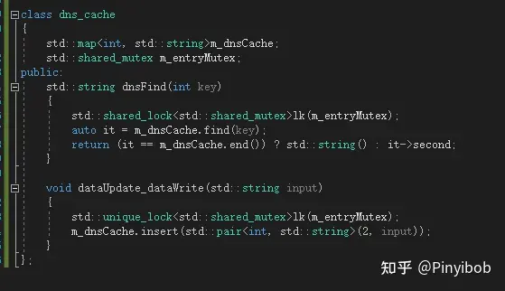

# 基础锁概念一览（c++）

计算机软件层面存在许多工程概念，但他们的实现机制本质是一致的；在操作系统层面则是信号量和管程；

笔者总结了下工程上对锁的一些概念，示例；

1：早版本的c++的stl库就提供了std::mutex（头文件<mutex>），称为独占锁，只能同时被一个线程占有；对独占锁，锁定两次会引发未定义行为；

RAII的意义在于在该类对象析构时，自动释放作用的对象，stl库中存在这种写法


2：共享锁（c++17），典型场景在读写环境使用；std::shared-mutex && std::sharedlock;（头文件<shared_mutex>）

多个线程可同时锁定shared_lock<typename t>lk(sharedMutex)，通常对应着读取数据的操作，这个操作与unique_lock锁定了shared-mutex的动作互斥，通常对应修改数据的操作；这两者是互斥的；

dns缓存读写例子：



3：自旋锁：如果有个线程，发现自旋锁被锁住了，区别于独占锁，不会进入进程阻塞的队列等待，而是会不停的轮询自己，能不能占有该锁(busy-waiting)；显然这个锁有效率和资源占用问题；linux的头文件有这个锁,(linux\spinlock);

4：递归锁；他的意义是：可以允许多次锁定，并增加计数；允许多次解锁减少计数，锁定解除的条件为，所有占用过该锁的线程，全部解锁；


悲观锁：每次读写都上锁再进行，总是假设有人在自己读写前之前会更改数据，因此效率堪忧，使用读写频繁的情况；

乐观锁：假设每次都没人改，先读写再说；一般会有一个版本号的记录，如果读写发现版本号不对，就锁住数据写入过程进行更改；git的push就是一种乐观锁；

最后讲一下std::unique_lock<>和lock_guard的功能差异；

Unique_lock更加灵活：第二个参数可以传入adopt_lock，以供让互斥元自己上锁；

也可以传入，std::defer_lock表示构造时未锁定，之后通过手动lock来控制上锁；

但更加笨重，传入的参数需要维护成本；

例如当我们需要比较两个经常被更改的数据是否一致时，可以通过unique锁暂时在构造时不锁定，在比较的上一行一起锁定；给个eg：
``` c++
friend bool operator==(typename lhs& ,typename & rhs ){

if(lhs == rhs)

return true;

std::unique-lock<std::mutex>lock_a(lhs.value,std::defer_lock);

std::unique-lock<std::mutex>lock_b(rhs.value,std::defer_lock);

std::lock(lock_a,lock-b);

return lhs.value==rhs.value;

}
```


示例来源于《c++并发编程实战》

编辑于 2022-06-09 09:49