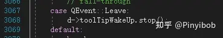
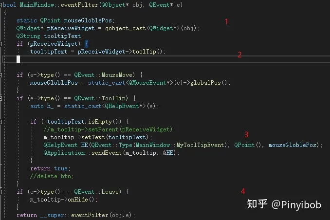

# qt全局消息截获应用示例和源码分析---自定义tooltip

qt的消息机制的源码在笔者快捷键与键盘事件关系的文章中已经有所涉及了；今天分享一下通过对全局消息截取，自定义tooltip的方法，以及qt关于原生tooltip源码的简略分析；

本文内容主要包括：

qt消息分发的方式；

qt原生tooltip主要源码分析；

通过消息截取，自定义tooltip；

## 1，QApplication::notify()
该函数是QCoreApplication::notify虚函数的实现。qt中发送到任何对象的所有事件，将调用此函数，是qt的消息分发枢纽，并且返回接收者事件处理程序的返回值；

qt的帮助文档也说了，重写某个控件的特定事件函数的功能是比较弱的，但是对notify的重写可以影响某一种特定类型事件的触发和相应；

除了重写该函数，也可以在QCoreApplication :: instance（）上安装事件过滤器。这样的事件过滤器能够处理所有小部件的所有事件，因此它与重新实现notify（）一样强大（path2）。也可以重新实现qobject::event()中的内容（path3）；也可以在最核心对象上安装事件过滤器来优先处理相关的事件（path4）；

在notify()函数之后，便开始进入各个对象的event函数了；若在某一级事件处理中return false，则会让该类的父类继续执行该事件；

## 2，qt原生Tooltip主要源码
打开qapplication.cpp，查看event()函数，和notify()函数便能大致知道tooltip的来龙去脉了，我们也可以用这个方法实现自定义的tooltip；在notify()的MouseMove中，qt用applicaiton的d指针记录了三个信息

分别是当前tooltip信号的接收者，此时鼠标的相对坐标及绝对坐标(toolTipGloblaPos);

tooltip功能在感官上给我们的感受是在鼠标停留一阵后，在鼠标指针的下方会显示tooltip，因此作用的位置，和作用的对象这两个要素是必须知道的；此时便记录下来了；

在event()函数的timer事件处理中有如下代码：

这个过程中包含了对计时器（2）和tooltip作用窗口的属性判断等操作，最核心的句子为：在需要显示tooltip时（3），构建一个helpEvent分发给d指针的tooltipWidget，若该事件被确认接受时，一个tooltip的timer开始计时（若干时间后使其消失）（1）；

会注意到，在实际中当我们的鼠标移开具有tooltip的窗口时，tooltip会立即消失，笔者找到了如下代码：

## 3，消息截取，自定义tooltip
由上我们可以知道的是，tooltip的显示需要的最基本信息有：

1，tooltip存在一个单例，源码的单例是d指针的toolTipWidget；

2，tooltip的显示需要知道tooltip事件出发时的鼠标位置；

3，离开事件发出时，关闭tooltip；

接下来，笔者简要描述一个简单的tooltip的demo代码：

对于全局事件的截取，笔者是对qapp安装了事件过滤器，在最主要的窗口mainwindow的事件过滤器中处理tooltip消息；这种做法的好处在于方便；

笔者仿照qt的方式，在mouseMove事件中记录下当前鼠标的全局坐标（1），并通过转化消息接收者的指针获取其tooltip的内容（2），在tooltip事件中，构建了一个帮助信号并将坐标信息传输给了m_tooltip的一个成员（Qlabel的简单子类），return ture，结束处理；另外为了方便起见，将tooltip的窗口实例作为mainwindow的一个成员并实例化；

在MyToolTip对象中，果然收到了自定义的消息（笔者偷懒写成了1001，实际应该写成枚举）

并在onShow函数中，将其显示出来；

最后效仿qt的做法，在leaveEvent消息触发时，便隐藏该tooltip的实例；

这样，tooltip的重写工作就大部分结束了；这里要注意的是tooltip的窗口属性最好设置为Qt::tooltip，以防止被当作window处理，另外加上一些简单的样式和文字长度处理逻辑：

窗口

我们得到的效果为：

至于计时器，动画，样式美观等细节，相信大家会自定义出满意的效果来；

另外tooltip的显示不会超出屏幕的边界，这里就交给读者思考了，关键字为：

笔者照例提供一个测试demo,cmake构建的vs工程使用方便，可以下载玩一下，有讲的不对的地方希望能指出；[pinyibob/QtCustomizeToolTip](http://link.zhihu.com/?target=https%3A//github.com/pinyibob/QtCustomizeToolTip)

编辑于 2021-02-18 10:24