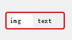
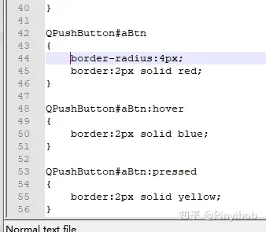
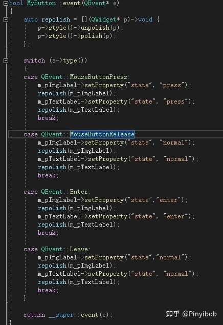
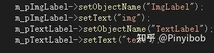
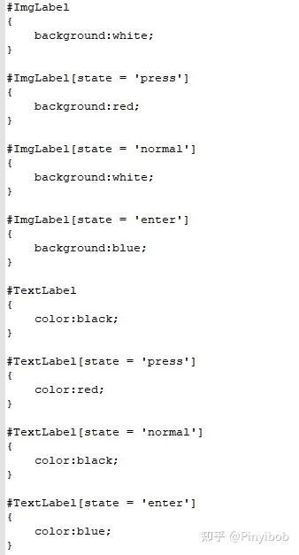
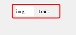
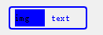
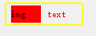

# qt一种通用自定义控件方法---setproperty
最近（闪电五连鞭时代）的商业软件对于交互界面提出了很高的要求，一个gui框架的内置控件和样式肯定是满足不了设计需求的；

对于qt框架而言，我们当然可以仿着那套dq指针，style绘制写一套出来，但是成本较高；而且许多需求只需要通过控件组合的方式便可以完成；但是控件组合的控件的一些事件是不能够“传递”或者说“设置”的；因此笔者将介绍一种在组合情况下尤其有用的方法：通过qobject::setproperty及QWidget::style()->polish()/unpolish()的通用自定义构建控件的方法；

以一个简单的例子写个demo：

需求：一个具有2px边框的按钮，按钮中左侧放置图片，右侧放置一段文字；

我们很容易想到，在一个pushbutton里面嵌套两个label即可，左侧放置图片label，右侧放置文字label，就如上图所示；

但是这时的hover，press的伪状态是没有办法“传递”给里面的控件的，对btn的伪状态样式表的设置，是不会传递到这两个label的伪状态的；例如，按下按钮的时候样式改变的只有btn边框而已

如果通过事件传递的方式，press的事件是没有办法传递的（经过笔者的多次尝试）；而且事件过滤器或者自定义消息发送的方式很麻烦，组合控件的成分越多构建越麻烦；

这个时候使用开题时讲到的方式，是最合适不过了；

继承自qobject类会有接口setproperty(),qt提供的这种方式可以和样式表配合使用，并将设置上的动态属性作为样式表的一种伪状态；再通过qwidget的style接口重新加载其样式即可；

废话不多说直接上代码：

在按钮处于各种状态时，通过给两个label设置动态属性，作为控件的伪状态使用，并重新加载样式，达到状态“传递”的效果；对应的样式表代码为

最后达到的效果为：

normal状态

hover状态

press状态

照例提供一个demo，cmake构建：pinyibob/QtTextIconButton照例提供一个demo，cmake构建：

[git_hub_link](https://github.com/pinyibob/QtTextIconButton)