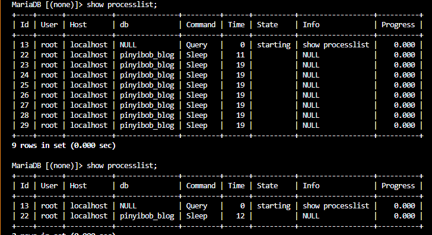
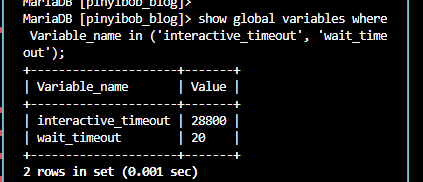
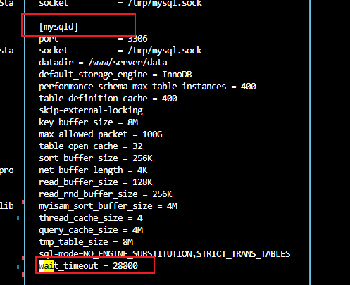

# 连接池及编写事项

为了避免每次访问数据库都创建，销毁连接，故创造连接池，和线程池，内存池都属于空间换时间的思路；

但mysql对于每个连接都设置了超时时间，默认28800秒即八个小时；超出这个时间链接被删除失效；

可以通过`show processlist;`命令查看当前的连接状况



可以通过'show global variables where Variable_name in ('interactive_timeout', 'wait_timeout');'命令查看两个全局超时参数；



配置文件修改路径为`/etc/my.cnf`



所以需要给连接池设置连接失效的机制，不然相比服务器是会定时崩溃的，我认为有两个办法
1. 设置timer定期执行selet 1，保持连接始终有效；
```
    void keepAlive() {
        // 发送心跳消息
        try {
            std::string heartbeatMessage = "SELECT 1";
            boost::asio::write(m_socket, boost::asio::buffer(heartbeatMessage));
        } catch (boost::system::system_error& e) {
            // 链接异常时，关闭连接并抛出异常
            m_socket.close();
            throw e;
        }

        // 重新设置心跳定时器
        m_timer.expires_from_now(boost::posix_time::seconds(m_keepAliveIntervalSeconds));
        m_timer.async_wait(std::bind(&DatabaseConnection::keepAlive, this));
    }
```

2. 获取连接时，使用mysql_ping接口，判断连接是否有效，若无效，则生成新连接；
```
    //检查链接是否仍然有效
	if(mysql_ping(con) != 0)
	{
		mysql_close(con);
		auto imp = mysql_init(nullptr);
		con = mysql_real_connect(imp, m_url.c_str(), m_User.c_str(),
		 m_PassWord.c_str(), m_DatabaseName.c_str(), m_Port, NULL, 0);
	}
```

关于'interactive_timeout',和'wait_timeout'已经有人说得很清楚了，session 变量只影响某次会话，而global变量则影响所有链接，需要重启mysql才能应用；

参考链接

[MySQL 的连接时长控制--interactive_timeout和wait_timeout](https://blog.csdn.net/lanyang123456/article/details/102535434)